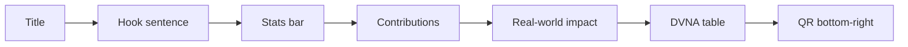

# Person B — VibeScan Poster, Abstract & Submission Plan

## Context

- This workspace ([cybersecurity-scanner](c:\Users\088sa\Downloads\Scholar\cybersecurity-scanner)) is the scanner codebase; there is **no** `[vibescan-research-poster.html](c:\Users\088sa\Downloads\Scholar\cybersecurity-scanner)` in the repo today. Person B must **bring in** the existing poster file (or recreate layout) before applying B1 edits.
- Recommended asset location: `docs/vibescan/` (poster HTML, abstract, pitch, handout, QR SVG) — keeps contest materials out of `src/` and matches your existing doc-style checklist ([vibescan-cursor-checklist-v2.md](c:\Users\088sa\Downloads\Scholar\cybersecurity-scanner\vibescan-cursor-checklist-v2.md)).

## Task B1 — Poster HTML updates (HIGH IMPACT)

**Prerequisite:** Copy or add `vibescan-research-poster.html` into `docs/vibescan/` (or confirm path if stored elsewhere).

**Edits (match existing dark theme + card + top accent bar):**

| Item                 | Implementation notes                                                                                                                                                                                                                                                                                                                        |
| -------------------- | ------------------------------------------------------------------------------------------------------------------------------------------------------------------------------------------------------------------------------------------------------------------------------------------------------------------------------------------- |
| Hook                 | Insert **below title**, **above** existing stats bar: one sentence exactly as specified; use larger `font-size` / `line-height` and high contrast for 6-ft readability (e.g. clamp or ~1.4–1.8rem+ depending on poster scale).                                                                                                              |
| Real-world impact    | New section **after contributions**: heading “Real-world impact”; **three cards** (Enrichlead, Tea App, CVE-2025-48757) with one line each: “VibeScan would have flagged **[specific rule]**…” — align rule names with your actual rule IDs/names from the scanner when possible (or use consistent placeholder until rules are finalized). |
| Evaluation table     | New section **after breach panel**: “Preliminary evaluation — DVNA benchmark”; **3 columns**: Vulnerability Class                                                                                                                                                                                                                           |
| QR placeholder       | **Bottom-right** fixed or grid cell: bordered box “Scan for GitHub repo”; reserve ~120×120px for later image swap.                                                                                                                                                                                                                          |
| Contribution numbers | Increase size/weight of **01–04** (e.g. larger numeral, `font-weight: 700`, spacing) for distance scanning.                                                                                                                                                                                                                                 |
| Contribution cards   | Audit each card: **bold 4-word title** + **one** supporting sentence; adjust copy if any card violates that pattern.                                                                                                                                                                                                                        |

**Out of repo (Person B):** Browser print-to-PDF as `vibescan-poster-FINAL.pdf`; physical print test at target poster size.

## Task B2 — Abstract (100–400 words; prompt asks 250–300)

- **Deliverable file:** `docs/vibescan/abstract.md` (or `.txt` for paste into form).
- **Structure:** Open with **slopsquatting / 19.7%** hook (not generic background); sentence 2 frames vibe coding + systemic risk; weave citations (SusVibes arXiv:2512.03262, BaxBench arXiv:2502.11844, Tenzai Jan 2026, Invicti 2025, Spracklen et al. USENIX Security 2025); name **VibeScan** + four contributions in **parallel** phrasing; one **preliminary DVNA sentence** with **placeholder** until Person A; close with **downstream scanning vs prompt engineering**.
- **QC:** Word count; read aloud; verify no “background-first” opening; all citations present.

**Out of repo:** Submit via conference form by **March 27, 2026**; screenshot confirmation (B3).

## Task B3 — Submission form (logistics)

No code. Checklist: form URL from competition page; corresponding author; collect names/emails; mentor name/email; submit abstract + metadata; save confirmation screenshot; poster chair email + calendar reminder for PDF **March 26**.

## Task B4 — QR code

- **After** repo is public and URL is final: generate **120×120** dark-theme QR (e.g. `docs/vibescan/qr-github.svg` — white modules on `#0a0a0f`, label `github.com/[username]/vibescan`).
- Embed in poster HTML (replace placeholder); **plain text URL** under QR as backup.
- **Out of repo:** Phone scan test.

## Task B5 — 60-second pitch + cue cards

- **Deliverable:** `docs/vibescan/pitch-60s.md` — ~140–150 words; starts with slopsquatting hook; **no** “Hi I’m…”; **one** sharp statistic; four contributions in one breath; closing line: *It’s the safety layer vibe coding never had.*
- **Six Q&A cue cards** (bullets, not paragraphs) covering eslint/npm audit, evaluation numbers, why not AI-only fix, false positives, what’s next, broader impact.

**Out of repo:** Time 55–65s; print cards; practice.

## Task B6 — Lessons learned (poster + pitch)

- **Content:** Four one-sentence items: **bold key phrase** + sentence; map to SusVibes, BaxBench, Invicti, Spracklen et al.; confident, citable tone.
- **Placement:** Add small poster section **or** conclusions in abstract; reuse when judges ask “what did you learn?”

## Task B7 — A5 handout (optional)

- **Deliverable:** `docs/vibescan/handout.html` — half-page / A5-friendly; dark theme; grayscale-safe (borders/contrast); sections: name + one line; 4 contributions; 3 stats; 3 breach one-liners; GitHub + QR; contact email.

**Out of repo:** Print 15–20; grayscale test.

## Dependencies from Person A (blockers to remove placeholders)

| Need                    | Used in                                                  |
| ----------------------- | -------------------------------------------------------- |
| DVNA comparison numbers | Poster table (B1), abstract sentence (B2), pitch Q2 (B5) |
| Rule count              | Poster copy if cited                                     |
| Public GitHub URL       | QR (B4), handout (B7), form if required                  |

## Suggested execution order (matches your priority list)

1. Draft + submit **abstract** (B2/B3) — hard deadline.
2. Poster: **breach panel** + **hook** + **contribution typography** (B1).
3. Drop in **DVNA table** when numbers arrive (B1/B2).
4. Finalize **pitch** (B5); add **lessons learned** (B6).
5. **QR** + URL when repo is public (B4); **handout** if time (B7).
6. PDF export + print proof (B1).

