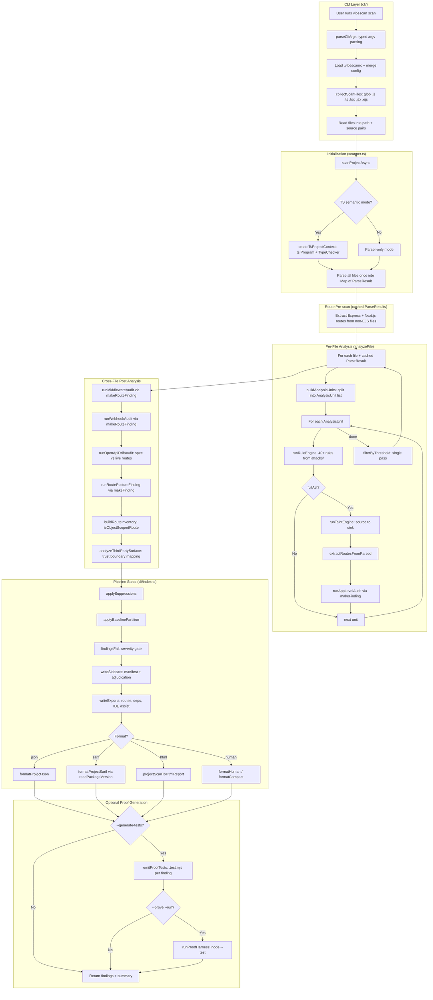
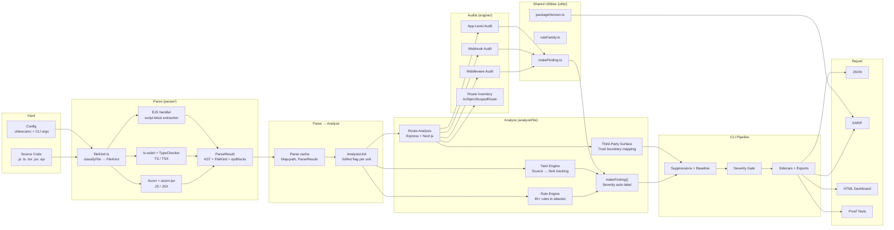
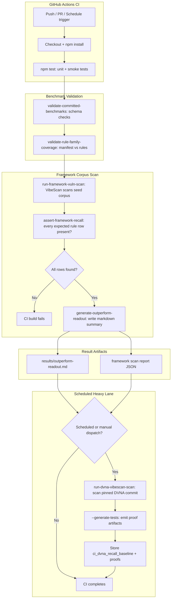
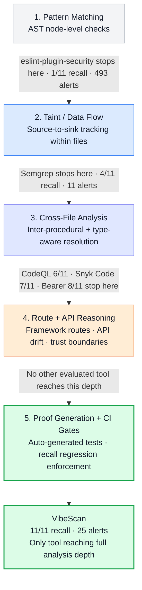

## Runtime Scan Flow

```mermaid
flowchart TD
  subgraph CLI ["CLI Layer  (cli/)"]
    U[User runs vibescan scan] --> PA[parseCliArgs: typed argv parsing]
    PA --> CFG[Load .vibescanrc + merge config]
    CFG --> CF[collectScanFiles: glob .js .ts .tsx .jsx .ejs]
    CF --> READ[Read files into path + source pairs]
  end

  READ --> SCAN[scanProjectAsync]

  subgraph INIT ["Initialization  (scanner.ts)"]
    SCAN --> TSQ{TS semantic mode?}
    TSQ -- Yes --> TSC[createTsProjectContext: ts.Program + TypeChecker]
    TSQ -- No --> SKIP[Parser-only mode]
    TSC --> PARSEALL
    SKIP --> PARSEALL
    PARSEALL[Parse all files once into Map of ParseResult]
  end

  subgraph PRESCAN ["Route Pre-scan  (cached ParseResults)"]
    PARSEALL --> ROUTEPRE[Extract Express + Next.js routes from non-EJS files]
  end

  subgraph PERFILE ["Per-File Analysis  (analyzeFile)"]
    ROUTEPRE --> LOOP[For each file + cached ParseResult]
    LOOP --> UNITS[buildAnalysisUnits: split into AnalysisUnit list]
    UNITS --> EACH[For each AnalysisUnit]
    EACH --> RULES[runRuleEngine: 40+ rules from attacks/]
    RULES --> FULL{fullAst?}
    FULL -- Yes --> TAINT[runTaintEngine: source to sink]
    TAINT --> ROUTE[extractRoutesFromParsed]
    ROUTE --> APP[runAppLevelAudit via makeFinding]
    FULL -- No --> NEXT[next unit]
    APP --> NEXT
    NEXT --> EACH
    EACH -- done --> FILTER[filterByThreshold: single pass]
    FILTER --> LOOP
  end

  subgraph CROSS ["Cross-File Post Analysis"]
    LOOP --> MW[runMiddlewareAudit via makeRouteFinding]
    MW --> WH[runWebhookAudit via makeRouteFinding]
    WH --> OA[runOpenApiDriftAudit: spec vs live routes]
    OA --> RP[runRoutePostureFinding via makeFinding]
    RP --> RI[buildRouteInventory: isObjectScopedRoute]
    RI --> DP[analyzeThirdPartySurface: trust boundary mapping]
  end

  subgraph OUTPUT ["Pipeline Steps  (cli/index.ts)"]
    DP --> SUP[applySuppressions]
    SUP --> BL[applyBaselinePartition]
    BL --> GATE[findingsFail: severity gate]
    GATE --> SIDE[writeSidecars: manifest + adjudication]
    SIDE --> EXP[writeExports: routes, deps, IDE assist]
    EXP --> FMT{Format?}
    FMT -- json --> JSON[formatProjectJson]
    FMT -- sarif --> SARIF[formatProjectSarif via readPackageVersion]
    FMT -- html --> HTML[projectScanToHtmlReport]
    FMT -- human --> HUM[formatHuman / formatCompact]
  end

  subgraph PROOF ["Optional Proof Generation"]
    JSON & SARIF & HTML & HUM --> GEN{--generate-tests?}
    GEN -- Yes --> EMIT[emitProofTests: .test.mjs per finding]
    GEN -- No --> DONE
    EMIT --> RUN{--prove --run?}
    RUN -- Yes --> HARNESS[runProofHarness: node --test]
    RUN -- No --> DONE
    HARNESS --> DONE
  end

  DONE[Return findings + summary]
```

## Architecture Overview

```mermaid
flowchart LR
  subgraph INPUT ["Input"]
    A["Source Code\n.js .ts .tsx .jsx .ejs"]
    B["Config\n.vibescanrc + CLI args"]
  end

  subgraph PARSE ["Parse  (parser/)"]
    FK["fileKind.ts\nclassifyFile → FileKind"]
    C["Acorn + acorn-jsx\nJS / JSX"]
    D["ts-eslint + TypeChecker\nTS / TSX"]
    EJ["EJS handler\nscript block extraction"]
    PR["ParseResult\nAST + FileKind + ejsBlocks"]
  end

  subgraph BRIDGE ["Parse → Analyze"]
    AU["AnalysisUnit\nfullAst flag per unit"]
    CACHE["Parse cache\nMap‹path, ParseResult›"]
  end

  subgraph ANALYZE ["Analyze  (analyzeFile)"]
    E["Rule Engine\n40+ rules in attacks/"]
    F["Taint Engine\nSource → Sink tracking"]
    G["Route Analysis\nExpress + Next.js"]
    H["Third-Party Surface\nTrust boundary mapping"]
    MF["makeFinding()\nSeverity auto-label"]
  end

  subgraph AUDIT ["Audits  (engine/)"]
    MA["Middleware Audit"]
    WH["Webhook Audit"]
    AL["App-Level Audit"]
    RI["Route Inventory\nisObjectScopedRoute"]
  end

  subgraph SHARED ["Shared Utilities  (utils/)"]
    PV["packageVersion.ts"]
    RF["ruleFamily.ts"]
    MK["makeFinding.ts"]
  end

  subgraph PIPELINE ["CLI Pipeline"]
    J["Suppressions + Baseline"]
    K["Severity Gate"]
    L["Sidecars + Exports"]
  end

  subgraph REPORT ["Report"]
    M["JSON"]
    N["SARIF"]
    O["HTML Dashboard"]
    P["Proof Tests"]
  end

  A --> FK
  B --> FK
  FK --> C
  FK --> D
  FK --> EJ
  C --> PR
  D --> PR
  EJ --> PR
  PR --> CACHE
  CACHE --> AU
  AU --> E
  AU --> F
  AU --> G
  E --> MF
  F --> MF
  G --> MA
  G --> WH
  G --> AL
  G --> RI
  MA --> MK
  WH --> MK
  AL --> MK
  MK --> MF
  G --> H
  MF --> J
  H --> J
  J --> K
  K --> L
  L --> M
  L --> N
  L --> O
  L --> P
  PV --> N
```

## CI Benchmark and Recall Gates

```mermaid
flowchart TD
  subgraph CI ["GitHub Actions CI"]
    START[Push / PR / Schedule trigger] --> DEPS[Checkout + npm install]
    DEPS --> UNIT[npm test: unit + smoke tests]
  end

  subgraph VALIDATE ["Benchmark Validation"]
    UNIT --> VB[validate-committed-benchmarks: schema checks]
    VB --> VF[validate-rule-family-coverage: manifest vs rules]
  end

  subgraph FRAMEWORK ["Framework Corpus Scan"]
    VF --> FS[run-framework-vuln-scan: VibeScan scans seed corpus]
    FS --> FA[assert-framework-recall: every expected rule row present?]
    FA --> PASS{All rows found?}
    PASS -- No --> FAIL[CI build fails]
    PASS -- Yes --> READ[generate-outperform-readout: write markdown summary]
  end

  subgraph ARTIFACTS ["Result Artifacts"]
    READ --> A1[results/outperform-readout.md]
    READ --> A2[framework scan report JSON]
  end

  subgraph HEAVY ["Scheduled Heavy Lane"]
    A1 & A2 --> HQ{Scheduled or manual dispatch?}
    HQ -- No --> DONE[CI completes]
    HQ -- Yes --> DVNA[run-dvna-vibescan-scan: scan pinned DVNA commit]
    DVNA --> PROOFS[--generate-tests: emit proof artifacts]
    PROOFS --> BASELINE[Store ci_dvna_recall_baseline + proofs]
    BASELINE --> DONE
  end
```

## Comparison: Analysis Depth — VibeScan vs DVNA Benchmark Tools

```mermaid
flowchart TD
  S1["1. Pattern Matching\nAST node-level checks"]
  S2["2. Taint / Data Flow\nSource-to-sink tracking within files"]
  S3["3. Cross-File Analysis\nInter-procedural + type-aware resolution"]
  S4["4. Route + API Reasoning\nFramework routes · API drift · trust boundaries"]
  S5["5. Proof Generation + CI Gates\nAuto-generated tests · recall regression enforcement"]

  S1 -->|"eslint-plugin-security stops here · 1/11 recall · 493 alerts"| S2
  S2 -->|"Semgrep stops here · 4/11 recall · 11 alerts"| S3
  S3 -->|"CodeQL 6/11 · Snyk Code 7/11 · Bearer 8/11 stop here"| S4
  S4 -->|"No other evaluated tool reaches this depth"| S5

  VS["VibeScan\n11/11 recall · 25 alerts\nOnly tool reaching full analysis depth"]
  S5 --> VS

  classDef basic fill:#f3f4f6,stroke:#9ca3af,color:#111827,stroke-width:1px;
  classDef flow fill:#dbeafe,stroke:#3b82f6,color:#111827,stroke-width:1px;
  classDef cross fill:#e0e7ff,stroke:#6366f1,color:#111827,stroke-width:1px;
  classDef advanced fill:#ffedd5,stroke:#ea580c,color:#111827,stroke-width:1px;
  classDef unique fill:#dcfce7,stroke:#16a34a,color:#111827,stroke-width:2px;

  class S1 basic;
  class S2 flow;
  class S3 cross;
  class S4 advanced;
  class S5,VS unique;
```
