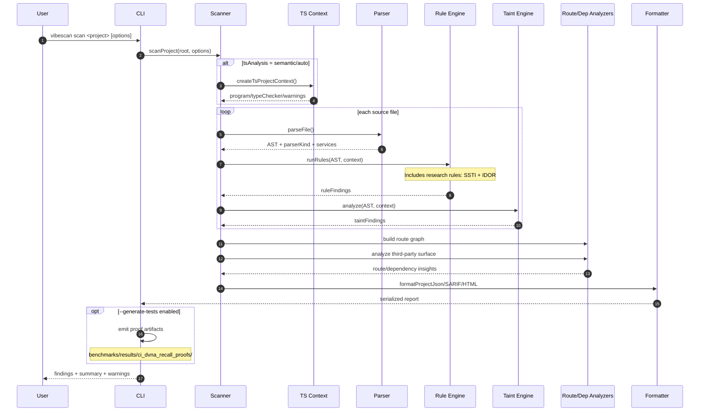
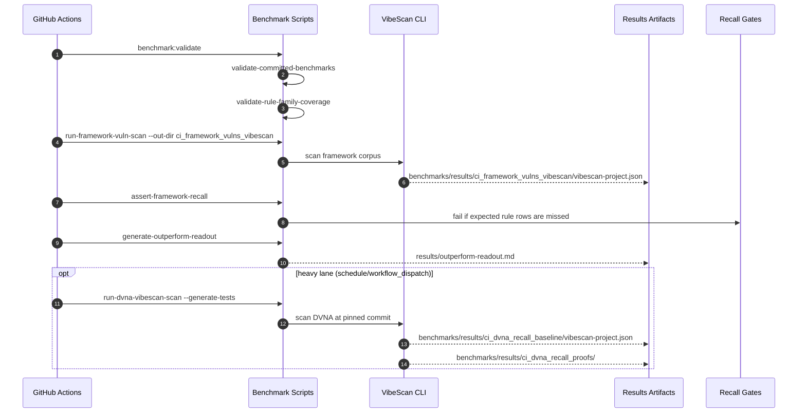

## Runtime Scan Flow

```mermaid
sequenceDiagram
autonumber
participant U as User
participant C as CLI
participant S as Scanner
participant T as TS Context
participant P as Parser
participant R as Rule Engine
participant D as Taint Engine
participant X as Route/Dep Analyzers
participant F as Formatter

U->>C: vibescan scan <project> [options]
C->>S: scanProject(root, options)

alt tsAnalysis = semantic/auto
  S->>T: createTsProjectContext()
  T-->>S: program/typeChecker/warnings
end

loop each source file
  S->>P: parseFile()
  P-->>S: AST + parserKind + services
  S->>R: runRules(AST, context)
  Note over R: Includes research rules: SSTI + IDOR
  R-->>S: ruleFindings
  S->>D: analyze(AST, context)
  D-->>S: taintFindings
end

S->>X: build route graph
S->>X: analyze third-party surface
X-->>S: route/dependency insights

S->>F: formatProjectJson/SARIF/HTML
F-->>C: serialized report

opt --generate-tests enabled
  C->>C: emit proof artifacts
  Note over C: benchmarks/results/ci_dvna_recall_proofs/
end

C-->>U: findings + summary + warnings
```

## CI Benchmark and Recall Gates

```mermaid
sequenceDiagram
autonumber
participant G as GitHub Actions
participant B as Benchmark Scripts
participant V as VibeScan CLI
participant R as Results Artifacts
participant Q as Recall Gates

G->>B: benchmark:validate
B->>B: validate-committed-benchmarks
B->>B: validate-rule-family-coverage

G->>B: run-framework-vuln-scan --out-dir ci_framework_vulns_vibescan
B->>V: scan framework corpus
V-->>R: benchmarks/results/ci_framework_vulns_vibescan/vibescan-project.json

G->>B: assert-framework-recall
B->>Q: fail if expected rule rows are missed

G->>B: generate-outperform-readout
B-->>R: results/outperform-readout.md

opt heavy lane (schedule/workflow_dispatch)
  G->>B: run-dvna-vibescan-scan --generate-tests
  B->>V: scan DVNA at pinned commit
  V-->>R: benchmarks/results/ci_dvna_recall_baseline/vibescan-project.json
  V-->>R: benchmarks/results/ci_dvna_recall_proofs/
end
```
