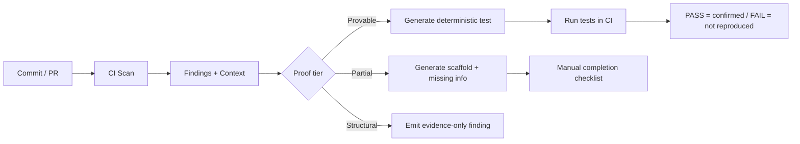

# Deep comparative research on JS/TS CI/CD security tools and differentiation opportunities for VibeScan

## Executive summary

Modern JavaScript/TypeScript CI/CD security tooling splits into two dominant families: **dependency/SCA** (e.g., `npm audit`) that reports *known* vulnerabilities in dependencies, and **code/SAST** (e.g., Snyk Code, Semgrep, CodeQL, Bearer, ESLint security plugins, Node-focused scanners like njsscan/nodejsscan) that reports *potential* vulnerabilities in application code. The strongest differentiators between these tools are not “how many findings,” but **how quickly a developer can validate a finding**, how reproducible the result is in CI, and how much contextual evidence the tool provides (dataflow paths, framework models, etc.). [1][2]

Across the mainstream tools reviewed here, **explainability has improved** (dataflow/taint traces, SARIF “flows,” query “precision” metadata), but **deterministic proof/reproduction artifacts** (e.g., runnable local tests that confirm exploitability without a live target) remain uncommon. This gap is especially clear when comparing tools’ official interfaces: SAST tools generally offer *detection + evidence*, not *detection + deterministic reproduction*. [3][4][5]

This positioning matches the current VibeScan framing: it explicitly targets actionability by emitting **deterministic local proof-oriented artifacts** (e.g., `.test.mjs` Node test files) and labels proof completeness (for supported families), while remaining **local-first and CI-friendly** with JSON/SARIF outputs. See **Implementation note (VibeScan)** below and repository paths [`vibescan/src/system/proof/pipeline.ts`](../../vibescan/src/system/proof/pipeline.ts), [`vibescan/src/system/types.ts`](../../vibescan/src/system/types.ts).

The best path to “show where and why we outperform” is to (a) benchmark **time-to-validate** and **proof coverage** against tools that already do well on explainability (especially Semgrep with taint traces and CodeQL path queries), (b) demonstrate that your deterministic proof artifacts **reduce triage time and increase correctness**, and (c) target framework-context areas where other tools are either heuristic-only or require deep customization (route + middleware posture; OpenAPI drift; explicit proof failure reasons). [1][6][7]

### Implementation note (VibeScan)

The scanner implements **proof-oriented test emission** in [`vibescan/src/system/proof/pipeline.ts`](../../vibescan/src/system/proof/pipeline.ts) (`emitProofTests`), attaches **`ProofGeneration`** metadata on each finding in [`vibescan/src/system/types.ts`](../../vibescan/src/system/types.ts) (`provable_locally` | `needs_manual_completion` | `unsupported`), and computes a **four-tier proof coverage summary** in [`vibescan/src/system/evidence.ts`](../../vibescan/src/system/evidence.ts) (`proofCoverageTier`, `summarizeProofCoverage`). Route and OpenAPI-oriented findings use [`FindingRouteRef`](../../vibescan/src/system/types.ts) and rules such as `API-INV-*` in [`vibescan/src/system/ruleCatalog.ts`](../../vibescan/src/system/ruleCatalog.ts). Frozen benchmarks and methodology are under [`results/dvna-evaluation.md`](../../results/dvna-evaluation.md).

## Research framing and evaluation dimensions

### Why “proof” and “time-to-validate” matter scientifically

A recurring theme in both academic and industry literature is that static analysis usefulness is constrained by **false positives**, **missing context**, and the downstream cost of triage (including suppression behavior and alert fatigue dynamics). Surveys and empirical studies emphasize that reducing false positives and improving usability/actionability is a core research challenge for static analysis tooling. [8][9]

For JavaScript/Node specifically, published large-scale comparisons of automated vulnerability detection report **variable precision and recall** across tools and corpora; “warnings alone” are often insufficient without stronger validation or evidence workflows. [1][10] Repository-specific frozen runs (e.g. DVNA) are documented in [`results/dvna-evaluation.md`](../../results/dvna-evaluation.md).

### Dimensions used for this comparison

The evaluation dimensions below map cleanly to how these tools are designed and documented:

- **Scope:** code SAST vs dependency/SCA vs hybrid
- **Languages:** JS/TS focus vs polyglot
- **Proof/reproduction:** does the tool generate runnable artifacts or only point to code?
- **Evidence/confidence model:** severity, rule confidence, precision metadata, prioritization scoring
- **Path/context awareness:** taint/dataflow, inter-file context, framework models; route/middleware/OpenAPI awareness
- **Local reproducibility:** can scans run offline / without vendor servers?
- **CI integration:** exit codes, diff/baseline modes, SARIF/JSON outputs, recommended CI patterns
- **Explainability:** traces/graphs/flows (in UI or artifacts like SARIF)
- **Time-to-validate:** not usually a built-in metric; best treated as an experimental outcome (see recommendations)

SARIF is central to CI explainability because it is a standardized interchange format for static analysis outputs (OASIS). [11] Platforms such as GitHub document which SARIF properties they render for code scanning. [12]

## Detailed analysis of existing tool capabilities

The sections below prioritize **official docs, official repos/READMEs, and peer-reviewed/archival academic sources**, and treat vendor blogs as secondary evidence.

### Snyk Code

**Core model and outputs.** Snyk Code is marketed and documented as a SAST offering integrated via web UI, IDE, and CLI, with inter-file analysis for languages like TypeScript and a triage surface that includes dataflow visualization and “fix analysis” (examples of fixes from real projects). [13]

**CLI and CI interface.** The primary CLI entrypoint for Snyk Code scanning is `snyk code test`, which supports JSON output (`--json` / `--json-file-output`) and SARIF output (`--sarif`), and optionally `--report` to send results to the Snyk web UI (creating or appending a project snapshot). [14]

**Evidence and prioritization.** Snyk’s ecosystem uses severity buckets and a “Priority Score” concept (0–1000) to rank issues for remediation; Snyk Code also documents that it does not use a “Critical” severity level. [13]

**Local reproducibility.** Snyk generally requires authentication for CLI usage, and their data-handling docs describe repository code access for analysis plus caching per provider policy (with retention of issue metadata after code removal). For organizations that need “local,” Snyk documents a “Snyk Code Local Engine,” but its published resource requirements are extremely large (Kubernetes-scale), implying it is not a typical student/local developer workflow. [13]

**Proof/reproduction gap (as documented).** Official Snyk docs emphasize **dataflow views** and **fix examples**, not generation of runnable proof artifacts (tests or PoCs). For your research framing, this positions Snyk as “high explainability + cloud-backed workflow,” not “deterministic local reproduction.” [14]

### Semgrep

**Core model and offline determinism.** Semgrep is documented as static analysis that does not execute code, can run from CLI/CI/IDE, and Semgrep’s documentation describes **offline** operation and deterministic behavior given the same inputs. [6]

**Outputs and CI integration.** Semgrep supports JSON and SARIF outputs from `semgrep scan` (including saving outputs to files), and Semgrep’s CI product (`semgrep ci`) is designed for CI usage; Semgrep AppSec Platform integrations typically require a platform token (`SEMGREP_APP_TOKEN`) when you want platform reporting/policies. [6][15]

**Evidence and “confidence.”** Semgrep’s rule ecosystem supports a documented “confidence” field (HIGH/MEDIUM, etc.) and the platform UI supports filtering by confidence, framing confidence as likelihood of true positives based on rule design. [6]

**Dataflow and cross-file traces.** Semgrep provides taint analysis primitives (source → propagators → sink), and Semgrep Code can provide **dataflow traces**; CLI usage can include `--dataflow-traces`. Semgrep’s docs also acknowledge fundamental analysis limitations such as lack of path sensitivity and limited pointer/shape analysis. [6]

**Local reproducibility nuance.** Semgrep can run offline, but using registry-driven modes like `--config auto` can involve registry interactions and metrics collection (which can be disabled). This matters for your “local-first reproducibility” claim: you can argue VibeScan avoids registry/telemetry concerns entirely for core operation. [6]

**Proof/reproduction gap (as documented).** Semgrep offers strong explainability (especially with traces) but does not document generating runnable “proof” tests as a product feature; it is designed to report findings and contextual traces, not to emit deterministic reproduction harnesses. [6]

### CodeQL

**Core model and CI usage.** CodeQL analysis is documented as building a database representing the codebase and then running queries; it supports JavaScript/TypeScript (including TypeScript as part of the JS library), and GitHub documents how CodeQL scanning works via CLI and code scanning. [7][16]

**Explainability via dataflow and path queries.** GitHub’s documentation explains “path queries” (`@kind path-problem`) whose results describe flows between a source and a sink, and CodeQL’s query docs describe dataflow analysis as a first-class approach used by many security queries. [7]

**Confidence model via query metadata.** CodeQL uses query metadata such as `@precision` (intended to describe proportion of true positives) and severity properties; GitHub also documents that extended query suites may return more false positives due to lower precision. This is useful for your comparison: CodeQL is unusually explicit about “precision” at the query/query-suite level. [7]

**Outputs and CI integration.** CodeQL CLI supports SARIF output intended for sharing results with other systems (and GitHub documents the details of its SARIF output format). The CLI setup documentation also notes the recommended approach (download the CodeQL bundle for compatibility and performance). [7][16]

**Framework/context awareness.** CodeQL publishes a “supported languages and frameworks” listing for built-in packs, indicating breadth (framework modeling) is a major part of its design. However, CodeQL’s out-of-the-box capabilities still primarily present results as database-query findings plus optional dataflow paths rather than route/middleware posture artifacts or runnable exploit proofs. [7]

### Bearer CLI

**Core model.** Bearer CLI is documented as SAST focused on security and privacy risks, with explicit “dataflow analysis” concepts (tainted input, sanitizers), as well as specialized reports (e.g., “dataflow report”). [10]

**Outputs and CI integration.** Bearer supports SARIF output (explicit CLI example), plus options to control exit codes and severity-based failure thresholds, and it provides GitHub Action guidance for code scanning uploads. [10]

**Languages.** Bearer documents support for JavaScript and TypeScript (among others). [10]

**Evidence/confidence.** Bearer’s documentation includes data classification accuracy claims and notes a tradeoff: patterns aim to minimize false positives at the expense of missing some true positives. This is a clear, citable “confidence posture,” although it is about data classification rather than exploit validation. [10]

**Proof/reproduction gap (as documented).** Bearer’s design emphasizes reporting and prioritization, plus dataflow reporting, not executable proof/test emission. [10]

### ESLint security plugins

ESLint’s model is rule-based linting; plugins flag patterns as warnings/errors according to rule logic, and ESLint provides extensibility via custom rules. [17]

For `eslint-plugin-security` specifically (widely used in Node/JS contexts), its own README warns it can generate many false positives requiring human triage—this is critical for your “time-to-validate” story because it is an explicit admission that detection does not equal actionability. [18]

Because it is lint-style, typical limitations include: minimal inter-file modeling, no taint trace graphs by default, and no reproducible proof artifacts (you can rerun lint to reproduce the *warning*, but not validate exploitability). [17][18]

### npm audit

`npm audit` is dependency vulnerability auditing: the command submits a description of your dependency tree to a registry and returns known vulnerability information plus remediation guidance; CI gating can be controlled using `--audit-level`, and `npm audit fix` can apply remediations (with caveats). [19]

A key limitation is that SCA findings may not correspond to actual reachable/executed code paths in your application; npm and ecosystem documentation discuss reachability and advisory relevance. This is a foundational gap vs code-aware proof artifacts. [19]

### Node.js-specific scanners

**njsscan** (and the broader nodejsscan ecosystem) is a Node-focused SAST approach that uses pattern matching plus Semgrep-based semantic patterns. The GitHub Action configuration for njsscan exposes explicit JSON and SARIF output modes and a “missing controls” check toggle, indicating a practical CI-facing interface. [20]

**nodejsscan** positions itself as a static security code scanner powered by libsast and semgrep (project docs repeat this), implying its detection can inherit many of Semgrep’s pattern-based strengths and limitations. [21]

For your comparison narrative, these Node-specific scanners tend to be strong on “Node/Express heuristics” (often including “missing security controls” checks), but they generally do not document deterministic proof/test generation as a core workflow. [20][21]

## Comparison table

The table below summarizes capabilities **as documented** in official docs/READMEs for each tool, focusing on the fields above. Sources align with the [References](#references) section.

| Tool | Scope (SAST/SCA) | Primary languages | Proof / repro capability | Reproduction commands (scan / rerun) | Evidence / confidence model | Path + context (route/middleware/OpenAPI) | Local reproducibility | CI modes + outputs | Explainability outputs | Notable limitations |
|---|---|---|---|---|---|---|---|---|---|---|
| Snyk Code | SAST (code) | Many (incl. JS/TS) | **Partial**: dataflow + fix examples; no documented runnable proof artifacts | `snyk code test [path]` (+ `--json`, `--sarif`, `--report`) | Severity (H/M/L) + prioritization (Priority Score); fix analysis presence can influence priority | **Partial**: inter-file analysis and dataflow; no documented route/middleware posture or OpenAPI drift as a dedicated feature | **Mostly non-local**: requires account/auth; code accessed for analysis; “local engine” exists but is very resource-heavy | CLI + CI integration; SARIF + JSON outputs; optional report-to-dashboard | Dataflow views; fix analysis examples | Cloud workflow + auth; proof is “evidence,” not deterministic reproduction |
| Semgrep (CE / Platform) | SAST (+ optional SCA/secrets via platform) | Polyglot incl. JS/TS | **Partial**: taint traces / dataflow traces; no documented runnable proof artifacts | `semgrep scan …` / `semgrep ci …` (`--sarif`, `--json`, `--dataflow-traces`) | Rule-defined severity; rule “confidence” metadata (HIGH/MEDIUM) supported and used for filtering | **Partial**: taint/dataflow; framework awareness depends on rules, packs, and (for cross-file) platform settings | **Strong local** for CE/offline; registry modes may involve metrics unless disabled | Native CI usage via `semgrep ci`; multi-format export; diff-aware scanning supported in CI workflows | Source→sink traces (esp. with dataflow traces); SARIF output | CE tradeoffs: limited cross-file by design; proof/test generation not a core feature |
| CodeQL | SAST (code via query DB) | Polyglot incl. JS/TS | **Partial**: path queries show flows; SARIF “flows”; no documented runnable proof artifacts | CLI: build DB + analyze, export SARIF; GitHub code scanning runs in CI | Query metadata includes `@precision`, severity; extended suites documented as lower precision | **Partial**: strong semantic + dataflow modeling; framework modeling exists; OpenAPI drift not described as standard output | **Strong local** with CodeQL CLI bundle; licensing/availability depends on repo type/org config | GitHub Actions integration + CLI; SARIF output documented | Path query flows, dataflow analysis concepts; SARIF details | High setup cost (DB generation); results still require manual validation |
| Bearer CLI | SAST (security + privacy) | JS/TS plus others | **No/Partial**: reports and dataflow report; no documented runnable proof artifacts | `bearer scan <path> …` (`--format sarif`, `--report dataflow`) | Severity + configurable fail thresholds; documented accuracy tradeoffs for data classification | **Partial**: dataflow analysis model; route/middleware/OpenAPI not described as a signature feature | **Strong local**: CLI scanning | SARIF + JSON/YAML/HTML; GitHub Action documented | Dataflow report outputs; security reports (CWE/OWASP links) | Evidence is reporting/traces, not deterministic exploit reproduction |
| eslint-plugin-security (ESLint) | lint/SAST-lite | JS (Node) | **No**: lint warnings only | `eslint …` (plugin rules) | Rule-based; README warns about many false positives needing human triage | **Low**: largely pattern/lint; minimal cross-file & no route/OpenAPI modeling by default | **Strong local** | Integrates as part of lint CI; output formats depend on ESLint reporter | Rule message + location | High false-positive burden; limited explainability vs taint/path tools |
| npm audit | SCA (dependencies) | JS ecosystem (Node) | **No**: advisories + remediation guidance | `npm audit`, `npm audit fix`, `--audit-level` for CI gating | CVSS/advisory metadata from registry sources; not code-path aware | **None**: no route/middleware/OpenAPI; not app-code-centric | **Network required** (submits dependency description to registry) | CI gating with exit codes; remediation automation via `audit fix` | Dependency graph/advisory reporting | Findings may not be relevant to reachable code paths; not application-code SAST |
| njsscan / nodejsscan | SAST (Node-focused patterns + semgrep) | Node/JS (some TS support varies) | **No/Partial**: findings + (sometimes) “missing controls” heuristics; no documented runnable proof artifacts | `njsscan <path> --json/--sarif`; CI actions available | Heuristic/pattern-based; output severity depends on tool rules | **Partial**: some Node security-control heuristics via flags; OpenAPI drift not typical | **Strong local** | JSON + SARIF outputs; integrates readily via CI wrappers | Finding lists + locations; depends on rule engine | Pattern-based limits; proof/test generation not core |

## Gaps that existing tools cannot easily replicate (and why that matters for VibeScan)

### Deterministic local proof artifacts are not a mainstream workflow primitive

Across the mainstream SAST tools documented above, the best-supported evidence mechanism is **dataflow trace explainability**: Snyk’s UI emphasizes dataflow views and fix examples, Semgrep offers taint/dataflow traces (including `--dataflow-traces`), and CodeQL provides path queries plus SARIF flows and metadata about expected precision. [13][6][7]

However, these features still largely stop at “here is why we think it’s a problem,” not “here is a runnable proof that confirms it.” In contrast, VibeScan’s stated core contribution is bridging findings into **deterministic local proof-oriented artifacts** (e.g., emitting `.test.mjs` artifacts with explicit proof status labels), and doing so without requiring a live API/remote target/AI service for core scanning and proof generation. See [`vibescan/src/system/proof/pipeline.ts`](../../vibescan/src/system/proof/pipeline.ts) and [`vibescan/src/system/evidence.ts`](../../vibescan/src/system/evidence.ts).

This is the core “non-replicable gap” you should emphasize: any competitor *could* theoretically add a separate PoC generator, but it is **not in their documented core workflow**, and in practice it conflicts with their scope (polyglot SAST) or product model (cloud-first triage UI). [6][14][16]

### Route/middleware posture and OpenAPI drift remain niche and usually require customization

General-purpose analyzers tend to improve context via **dataflow paths**, not via explicit **web-app posture models**. CodeQL and Semgrep can be extended to target frameworks, but these extensions typically require writing queries/rules and do not “ship” as a deterministic route+multiplexer posture artifact in the way VibeScan aims to present it. [7][6]

Node-specific scanners sometimes provide “missing controls” checks, but those are typically heuristic checks rather than a route graph + middleware chain explanation paired with deterministic proof tiers. [21]

### Local-first reproducibility is uneven across the market

Semgrep CE explicitly claims offline capability and determinism, and CodeQL CLI can run locally given the bundle and setup, while tools like Snyk are commonly cloud-backed (authentication required; repo code temporarily cloned/accessed for analysis) unless an enterprise-grade local engine is deployed (with high resource requirements). [6][7][13]

This supports a defensible differentiator for VibeScan if you demonstrate: “deterministic proof artifacts + local-first CI integration” with low infrastructure friction. See [`vibescan/src/system/proof/pipeline.ts`](../../vibescan/src/system/proof/pipeline.ts).

**Figures:** For competitor UIs, use screenshots from each vendor’s own documentation (Snyk data flow, Semgrep dataflow traces, CodeQL path query results, Bearer dataflow report) rather than third-party composites.

## Prioritized feature recommendations for VibeScan

The feature list below is designed to (a) create differentiators that are hard to match with “just another SAST rule pack,” and (b) map directly to measurable experiments: proof coverage, time-to-validate, correctness, and CI friction. Implementation notes assume the current VibeScan direction (rule families + route tracking + proof generation + JSON/SARIF outputs); several items are already partially implemented—see [`vibescan/src/system/evidence.ts`](../../vibescan/src/system/evidence.ts) and [`docs/vibescan/CI-PROVE.md`](./CI-PROVE.md) (CI proof harness).

Effort estimates are relative engineering effort for an undergraduate team (S = days; M = 1–2 weeks; L = multiple weeks).

| Priority | Feature | What it proves (competitive narrative) | Implementation notes (data/algorithms) | Effort |
|---|---|---|---|---|
| High | **Proof Coverage & Determinism Index** | “We don’t just find bugs; we quantify how many are *provably reproducible locally*.” This is not a standard metric in other tools’ official workflows. | Tiered metadata per finding + repo summary (`summarizeProofCoverage`); optional determinism flags in `ProofGeneration` (see types + JSON export). | S |
| High | **Auto-execute proofs in CI with stable harnesses** | “Our proofs run in CI, producing pass/fail evidence artifacts.” Competitors typically stop at traces. | Documented `node --test` harness; mock req/res, isolate sinks; see [`docs/vibescan/CI-PROVE.md`](./CI-PROVE.md). | M |
| High | **Route + middleware chain evidence objects** | “We outperform on framework posture because we model routes/middleware explicitly.” | Static route graph + `FindingRouteRef` / `RouteNode` in codebase; extend per-route evidence. | M |
| High | **OpenAPI drift + security-scheme conformance checks** | “We link code posture to documented API surface and auth claims.” Few SAST tools expose this as a first-class workflow artifact. | Parse OpenAPI; map operations to inferred routes (`API-INV-*`); extend security-scheme checks as needed. | M |
| Medium | **Evidence-based confidence explanation** | “Our confidence is evidence-driven, not a black box.” (Strong contrast to purely heuristic scanners; complements Semgrep confidence metadata.) | Represent confidence as structured explanation: path present, sanitization, route signals; see `evidence.ts`. | S–M |
| Medium | **Proof-failure explanations as research artifacts** | “We draw a clear boundary between static evidence and dynamic uncertainty.” This is rare in commercial tools’ outputs. | Taxonomy of proof failure; `failureReason` on `ProofGeneration`; emit in JSON/SARIF. | S |
| Medium | **Cross-tool SARIF normalizer (import competitor outputs)** | “Even when others find things, we can convert results into our proof workflow.” This is a unique bridge. | SARIF ingestion → VibeScan finding schema; opportunistic proof generation. | L |
| Medium | **Fix-impact preview (“proof turns red after fix”)** | “We can validate that a fix neutralizes the vulnerability.” | Optional fix templates; run proof test before/after patch in temp worktree. | L |
| Lower | **Rule authoring UX for proof-backed families** | “Proof-backed detection is extensible.” | Templates and test fixtures for new rules + proof generators. | M |

## Experiments, metrics, and poster-ready visuals to demonstrate superiority

### Experiments and metrics

The research goal is to show **where and why** VibeScan outperforms, not necessarily that it “finds more.” High-rigor experiments include:

**Benchmark experiment (controlled).** Use DVNA (already in your workflow) and a second benchmark set that is still controlled. Pair each tool run with frozen versions, consistent scopes, and adjudication. See [`results/dvna-evaluation.md`](../../results/dvna-evaluation.md) and [`docs/vibescan/BENCHMARK-SECOND-CORPUS.md`](./BENCHMARK-SECOND-CORPUS.md).

**Key metrics to report (in addition to TP/FP/FN):**
- **Proof-supported rate:** % findings with runnable local proof (by family and overall)
- **Proof success rate:** % proofs that actually confirm vulnerability under harness assumptions
- **Time-to-validate (TTV):** median time for a developer to reach “confirmed / rejected” decision
- **Decision accuracy:** whether participants correctly validated (ground-truth)
- **Evidence completeness score:** presence of trace/path, route/middleware context, remediation hint, and explicit proof tier labeling

Static analysis research on false positives and suppression supports treating “developer effort” and “noise reduction” as first-class outcomes. [8][9]

**Ablation study (causality).** Run VibeScan in three modes:
- detection-only
- detection + route/middleware context
- detection + route/middleware context + proof artifacts

Protocol and how to derive modes from exports: [`docs/vibescan/ABLATION-AND-TTV.md`](./ABLATION-AND-TTV.md).

This isolates the causal effect of “proof” vs “better detection.” It also cleanly distinguishes you from tools whose main advancement is improved detection or improved traces. [6][7]

**Human study (small but powerful).** A lightweight within-subject design:
- 8–12 participants (students or developers)
- Each participant validates a balanced set of findings from (a) Semgrep taint traces, (b) CodeQL path queries, (c) Snyk Code CLI output, (d) VibeScan proofs
- Randomize order; cap each task to e.g. 6 minutes

Outcome: the most judge-friendly graph is median **time-to-validate** (with IQR) plus correctness. Full protocol: [`docs/vibescan/ABLATION-AND-TTV.md`](./ABLATION-AND-TTV.md).

### Suggested visualizations

**Comparison table (poster-ready).** A simplified version of the big table: rows = tools, columns = Proof artifacts, Trace explainability, Local-first, Route/middleware posture, OpenAPI drift.

**Stacked bar chart.** “Finding outcomes by proof tier”:
- provable locally
- partial proof
- structural only
- detection only

**Bar chart.** “Median time-to-validate” by tool, with `n` labels.

**Ablation bar chart.** “Actionability rate” across VibeScan modes:
- detection-only
- + context
- + context + proof

**One workflow diagram.** Side-by-side: “warning → manual repro” vs “finding → proof → run”.

### Sample poster figures and diagrams

**Workflow diagram (Mermaid)**

**Ablation figure (caption + structure)**

- Title: *Ablation: what causes actionability gains?*
- X-axis: `Mode A: detect`, `Mode B: detect+route`, `Mode C: detect+route+proof`
- Y-axis: `Actionability rate (%)` or `Median TTV (seconds)`
- Caption claim: “Adding proof artifacts reduces time-to-validate more than route context alone.”

**Comparison figure (caption + structure)**

- Title: *Detection vs Validation: tools differ on what they optimize*
- Plot: two-axis scatter
  - X = detection recall (TP / (TP+FN))
  - Y = validation support (proof-supported rate)
- Expectation: Semgrep/CodeQL/Snyk may score well on recall + trace evidence, but cluster low on validation support; VibeScan’s thesis is high validation support for supported families.

---

**Key “gap statement” you can defend with this research**

Existing JS/TS CI/CD tools increasingly provide *explanations* (dataflow traces, query paths, SARIF flows) but generally do not provide **deterministic, runnable local proof artifacts** as a first-class workflow output. VibeScan’s opportunity is to treat “proof” as a measurable CI artifact—improving reproducibility, reducing time-to-validate, and making limitations explicit through proof tiers—while leveraging route/middleware and OpenAPI drift context to target web-app posture where generic tools require significant customization. [5][6][7][14][20]

## References

1. OWASP Foundation. *OWASP Benchmark Project* (methodology for evaluating static analysis tools). https://owasp.org/www-project-benchmark/
2. GitHub Docs. *SARIF support for code scanning.* https://docs.github.com/en/code-security/code-scanning/integrating-with-code-scanning/sarif-support-for-code-scanning
3. GitHub Docs. *About GitHub CodeQL.* https://docs.github.com/en/code-security/code-scanning/introduction-to-code-scanning/about-code-scanning-with-codeql
4. GitHub Docs. *CodeQL CLI SARIF output.* https://docs.github.com/en/code-security/codeql-cli/using-the-advanced-functionality-of-the-codeql-cli/sarif-output-for-codeql-databases
5. OASIS. *SARIF Version 2.1.0.* https://docs.oasis-open.org/sarif/sarif/v2.1.0/sarif-v2.1.0.html
6. Semgrep, Inc. *Semgrep documentation* (CLI, scan, SARIF, taint mode, `semgrep ci`, metrics). https://semgrep.dev/docs/
7. GitHub. *CodeQL documentation* (JavaScript/TypeScript, data flow, query help). https://codeql.github.com/docs/
8. Representative survey: static analysis usability and adoption (search: “Why don’t software developers use static analysis tools” / ICSE literature).
9. Further reading: developer-facing studies on static analysis false positives and triage cost (ACM / IEEE digital libraries).
10. Bearer. *Bearer CLI documentation.* https://docs.bearer.com
11. OASIS. *Static Analysis Results Interchange Format (SARIF).* https://www.oasis-open.org/committees/tc_home.php?wg_abbrev=sarif
12. GitHub Docs. *SARIF support for code scanning* (property support). https://docs.github.com/en/code-security/code-scanning/integrating-with-code-scanning/sarif-support-for-code-scanning
13. Snyk. *Snyk Code* and *Snyk CLI* documentation. https://docs.snyk.io/scan-with-snyk/snyk-code https://docs.snyk.io/snyk-cli/commands/code
14. Snyk. *Snyk CLI: `snyk code test`.* https://docs.snyk.io/snyk-cli/commands/code
15. Semgrep. *Semgrep in CI (`semgrep ci`).* https://semgrep.dev/docs/semgrep-ci/overview/
16. GitHub Docs. *About CodeQL code scanning.* https://docs.github.com/en/code-security/code-scanning/introduction-to-code-scanning/about-code-scanning-with-codeql
17. ESLint. *ESLint documentation.* https://eslint.org/docs/latest/
18. eslint-community. *eslint-plugin-security* (README). https://github.com/eslint-community/eslint-plugin-security
19. npm. *npm audit.* https://docs.npmjs.com/cli/commands/npm-audit
20. ajinabraham. *njsscan* (GitHub). https://github.com/ajinabraham/njsscan
21. ajinabraham. *nodejsscan* (GitHub). https://github.com/ajinabraham/nodejsscan
