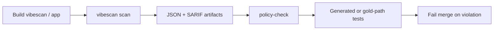

# Pipeline protection roadmap (CI / merge gates)

Goal: position VibeScan as part of **security verification**—static signal, machine-readable outputs, explicit policy, and (where feasible) generated or gold-path regression tests.

## Target merge pipeline (ordered)



### 1. Build

- `npm ci` / `npm run build -w vibescan` as needed.  
- Application under test builds independently.

### 2. Scan

```bash
node vibescan/dist/system/cli/index.js scan ./app --format json --exclude-vendor > vibescan-out.json
node vibescan/dist/system/cli/index.js scan ./app --format sarif --exclude-vendor > vibescan-out.sarif
```

- Pin CLI via lockfile / container digest for reproducibility.  
- Optional: `--check-registry` on schedule or dedicated job (network).

### 3. Export

- Upload SARIF to GitHub Advanced Security or equivalent.  
- Retain JSON for policy and benchmarks.

### 4. Policy check

```bash
node vibescan/scripts/policy-check.mjs policy.json vibescan-out.json
```

- Boolean flags for architectural expectations (see [`secure-arch-policy-bridge.md`](./secure-arch-policy-bridge.md)).  
- **`denyRuleIds`** for explicit “must never appear” rules (e.g. `injection.sql.string-concat`).

### 5. Generated / gold-path tests

- Run Vitest/Jest suite from [`benchmarks/gold-path-demo/`](../../benchmarks/gold-path-demo/) or app workspace.  
- Prefer **behavioral** tests where safe; otherwise **scan regression** on committed fixtures.

### 6. Fail merge

- Non-zero exit from **policy-check** or **test** fails the job.  
- Optionally: fail on SARIF gate in platform (separate from VibeScan exit code).

## Maturity levels

| Level | Scan | SARIF | policy-check | denyRuleIds | Gold tests |
|-------|------|-------|--------------|-------------|------------|
| L0 | Ad hoc | No | No | No | No |
| L1 | CI | Yes | No | No | No |
| L2 | CI | Yes | Yes | Partial | No |
| L3 | CI | Yes | Yes | Yes | Gold demo |
| L4 | CI | Yes | Yes | Yes | App + gold + generated |

## Honest boundaries

- Static analysis **cannot** prove absence of bugs.  
- Policy encodes **organizational** risk tolerance, not universal security.  
- Generated tests are **regression harnesses**, not formal verification.

## References

- [`policy-check.mjs`](../../vibescan/scripts/policy-check.mjs) — CI-oriented policy gate.  
- [`policy-core.mjs`](../../vibescan/scripts/policy-core.mjs) — shared evaluation logic.  
- [`.github/workflows/vibescan.yml`](../../.github/workflows/vibescan.yml) — scanner workflow (extend with policy-check as needed).
